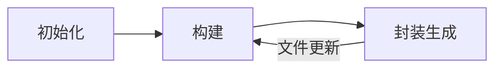

## 构建流程

### 初始化

- 合并参数：从配置文件、命令行参数、默认参数中读取配置，合并为最终执行的参数
- 创建编译器对象：用初始化的参数创建 Compiler
- 开始编译：执行 `Compiler.run` 创建 Compilation 对象
- 确定入口：根据 entry 配置，找到所有的入口模块

### 构建

- 从 entry 开始读取文件，调用 loader，遍历 loader 链将模块编译为 JavaScript 代码（IO 操作 & CPU 计算密集 & loader 可能会重复进行代码和 AST 之间的相互转换）
- 调用 JavaScript 解析器（[Acorn](https://github.com/acornjs/acorn)）将代码转为 AST （代码复杂度）
- 遍历 AST，找到该模块的依赖，递归处理这些依赖模块，直到所有的入口模块处理完成（模块数量）
- 构建出依赖关系图

### 封装生成

- 根据入口和模块之间的依赖关系，按规则将模块组装为一个个的 Chunk 对象（分包计算）
- 对 Chunk 进行一系列处理，包括翻译为能够运行的产物包、代码优化等操作（Terser 大量 AST 运算）
- 确定输出内容后，写入文件系统

## 插件系统

基于 [Tapable](https://github.com/webpack/tapable) 实现，利用各个时机触发的钩子来传递上下文信息，编写的加插件就是利用这些钩子的回调来修改上下文的内容，进而影响后续的编译流程。在整个构建流程中，Webpack 会在不同阶段触发不同的钩子。